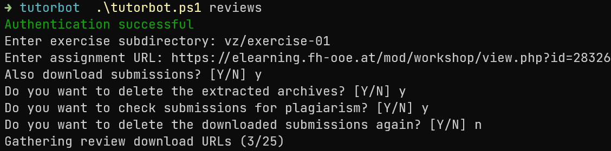

[](https://github.com/jheinzel/tutorbot/actions/workflows/ci.yml)
[](https://github.com/jheinzel/tutorbot/releases)
[](https://github.com/jheinzel/tutorbot/blob/master/LICENSE)

# Tutorbot

Tutorbot is a simple command line tool that helps programming tutors at the University of Applied Sciences in Hagenberg
by automating repetitive tasks.

## Download

https://github.com/jheinzel/tutorbot/releases

## Features

Tutorbot comes with a range of different features, it can support you by:

* downloading all reviews for a certain exercise
* downloading (and extracting) all submissions for a certain exercise
* checking submissions for plagiarism
* choosing reviews to give feedback on based on the amount of feedbacks a student has received
* sending feedback emails to students

## Configuration

Tutorbot requires different user inputs, some of them are likely repetitive. To avoid repeating them every time, these
inputs can be stored in a configuration file. The following example contains the most commonly used settings:

```properties
# Moodle username and base url
moodle.username=ha20210005
# Set the password for ease of use
moodle.password=XXXXXX
# Uncomment to authorize with the moodle cookie instead of local username and password
# moodle.auth.method=cookie
# Email address and username of person who sends feedback emails
email.address=sXXXXXXXXXX@fhooe.at
email.username=sXXXXXXXXXX
# Base directory where downloaded files will be stored
location.basedir=../
# Subdirectory where submissions and reviews will be stored
location.submissions.subdir=submissions
location.reviews.subdir=reviews
# CSV where count of feedbacks will be saved at. For multiple tutors, a fileshare like OneDrive or network drive is recommended.
# Ex. C:/Users/Tutor/OneDrive/SWO3/Tutorbot/feedback-count.csv
feedback.csv=../feedback-count.csv
# Templates for Email use %s for template parameters, Umlaute i.e ä, ö, ü are not supported by the encoding
email.template.subject=Feedback zur Uebung %s
email.template.body=Hallo,\n\nanbei euer Feedback zur Uebung %s.\nBei Fragen koennt ihr mir gerne auf diese E-Mail antworten.\n\nLG\n XXX.
```

For Tutorbot to detect this file, it should be located in the same directory as the `tutorbot.jar` and should be
called `tutorbot.properties`. It is also possible to configure those parameters using environment variables (properties
have '.' instead of '_'):

| Environment variable                        | Description                                                                                                                               |
|---------------------------------------------|-------------------------------------------------------------------------------------------------------------------------------------------|
| `TUTORBOT_MOODLE_USERNAME`                  | Moodle username (only works for local accounts since mandatory 2FA).                                                                      |
| `TUTORBOT_MOODLE_PASSWORD`                  | Moodle password.                                                                                                                          |
| `TUTORBOT_MOODLE_URL`                       | Moodle base url (default https://elearning.fh-ooe.at/)                                                                                    |
| `TUTORBOT_MOODLE_AUTH_METHOD`               | Moodle authorization method used for downloading. Can optionally be set to "cookie". Default authorization uses username and password.    |
| `TUTORBOT_MOODLE_COOKIE_NAME`               | Name of the Moodle cookie for cookie authorization (default is MoodleSessionlmsfhooe).                                                    |
| `TUTORBOT_EMAIL_ADDRESS`                    | E-Mail address the feedback will be sent from.                                                                                            |
| `TUTORBOT_EMAIL_USERNAME`                   | Username for the E-Mail service.                                                                                                          |
| `TUTORBOT_EMAIL_PASSWORD`                   | Password for the E-Mail service.                                                                                                          |
| `TUTORBOT_EMAIL_TEMPLATE_SUBJECT`           | Template string for the subject of E-Mails sent to students. %s is used as placeholder.                                                   |
| `TUTORBOT_EMAIL_TEMPLATE_BODY`              | Template string for the body of E-Mails sent to students. %s is used as placeholder.                                                      |
| `TUTORBOT_EMAIL_STUDENTS_SUFFIX`            | Suffix of E-Mail addresses of students (default fhooe.at).                                                                                |
| `TUTORBOT_LOCATION_BASEDIR`                 | Base-location where Tutorbot will create other folders.                                                                                   |
| `TUTORBOT_LOCATION_EXERCISE_SUBDIR`         | Subfolder of basedir for the exercise.                                                                                                    |
| `TUTORBOT_LOCATION_SUBMISSIONS_SUBDIR`      | Subfolder of exercise as download location for submissions.                                                                               |
| `TUTORBOT_LOCATION_REVIEWS_SUBDIR`          | Subfolder of exercise as download location for reviews.                                                                                   |
| `TUTORBOT_FEEDBACK_AMOUNT`                  | Amount of reviews that will be chosen by choose-feedback.                                                                                 |
| `TUTORBOT_FEEDBACK_RANDOM_AMOUNT`           | Amount of reviews that will be randomly chosen in choose-feedback. Independent of feedback count received, may only be <= feedback count. |
| `TUTORBOT_FEEDBACK_CSV`                     | Location of the feedback count CSV file. Absolute or relative path independent of other variables.                                        |
| `TUTORBOT_PLAGIARISM_LANGUAGE_JAVA_VERSION` | Java language version used by JPlag for plagiarism detection (default is Java 1.9). Also supports C/C++.                                  |

Values from the properties file will take precedence over values from environment variables if both are specified.

## Using the tutorbot

The folder "tutorbot" contains everything needed to run the cli tool.
If it is your first time using the Tutorbot, the command `tutorbot instructions` helps you get an overview of the steps to take.

On Windows use the powershell script `tutorbot.ps1` followed by the command you want to execute. The following image
show how to execute the `reviews` command. This uses the default `tutotrbot.properties` and creates the
folder `../vz/exercise-01/reviews` containing the downloaded reviews and `../vz/exercise-01/submissions` containing the
submission + the result of the plagiarism check.



If you are getting weird characters in your console, your terminal probably does not have support for ANSI Color Codes
enabled. If you are on Windows, this can be fixed by using the `Windows Terminal` app or by using
the `tutorbotWithoutWT.ps1` script (instead of `tutorbot.ps1`) which opens a powershell session with ANSI color codes
enabled.

### Authorization with cookie

Since moodle has a strict OIDC authorization for students' accounts, a simple login with username and password is not
possible anymore.
Current workarounds include:

* Using a local moodle account, which is added to the courses.
* Authorizing with a student account using a copied cookie from a browser.

To perform the latter a few steps have to be taken:

* Enabling `moodle.auth.method=cookie` in the properties.
* Logging in moodle using any browser.
* Copying the value of the `MoodleSessionlmsfhooe` Cookie after successful login.

After this, any download command of tutorbot can be performed using the cookie value. If this did not work,
check if the cookie value changed after a browser refresh.

### Sharing a feedback-count.csv with multiple tutors
Every tutor should use the same `feedback-count.csv` file when using the `choose-feedback` command.
This is why a fileshare or network drive should be used to synchronize the file state.

For example OneDrive works well for sharing the feedback count ([Tutorial from Microsoft](https://support.microsoft.com/en-us/office/add-and-sync-shared-folders-to-onedrive-for-home-8a63cd47-1526-4cd8-bd09-ee3f9bfc1504)):
1. To setup a shared folder create it in your OneDrive.
2. Using the share menu, give the other tutors edit access to your folder.
 
or 

1. To use a shared folder, login to the OneDrive web interface.
2. On the left navigation pane, select 'Shared'.
3. Select the shared folder, and then press the 'Add shortcut to My files' button on the top.
4. Now the folder can also be accessed in your local OneDrive.

## Buildling this project

Tutorbot is built using Gradle. You don't need to install anything, as the Gradle wrapper is included in the repository.
To build the project, simply execute `./gradlew jar`, the resulting JAR file will be located
under `/build/libs/tutorbot.jar`. Please note that a JDK with version 11 or higher is required to build and run this
tool, this limitation comes from JPlag. 

## Releasing a new version
First the version in the `build.gradle.kts` has to be updated. Then the following steps have to be performed:
Before releasing, check if your changes are merged in the main branch.  
To release a new version, create and push a `tag` on the main branch with a name like `v*.*`. 
This can be done with the following commands:
* `git tag v1.X.X [-a|-s]` (`-a` for unsigned, `-s` for signed)
* `git push origin v1.X.X`

The release pipeline is then triggered, which builds and packages the `tutorbot.jar` with files from `/tutorbot` into a zip-file. After that, a GitHub release will be created with the zip-file and the annotation from the tag. 
